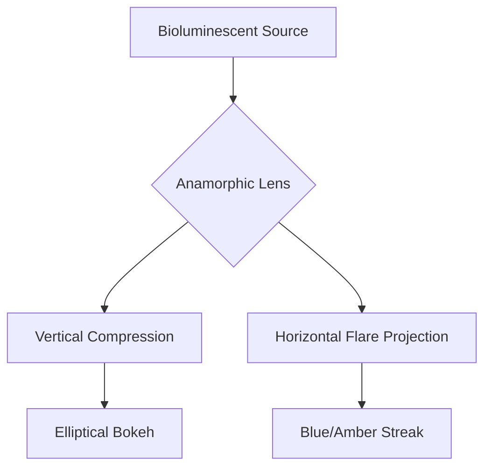

# Glow Logic: Bioluminescent Physics

## 🔬 Overview
The creatures in the *Tall Grass* exhibit high-frequency bioluminescence generated via a specialized crystal-matrix organ located near the dorsal ridge. This light is not merely aesthetic; it is a primary communication and aggression vector.

## 🌈 Spectral Standards
The film utilizes specific wavelengths to denote creature intent and physiological state.

| State | Color | Wavelength ($\lambda$) | Frequency ($f$) |
| :--- | :--- | :--- | :--- |
| **Idle / Foraging** | Amber | $600nm$ | $\approx 500\,THz$ |
| **Aggression / Hunt** | Blue | $450nm$ | $\approx 666\,THz$ |
| **Distress** | Pulsing Violet | $400nm$ | $\approx 750\,THz$ |

### Mathematical Model of Pulse Frequency
The pulse rate ($P_r$) during aggression is modeled by:
$$P_r = \int_{t_0}^{t_1} A \cdot \sin(2\pi f_b t + \phi) dt$$
where $A$ is the arousal amplitude and $f_b$ is the base bioluminescent frequency.

---

## 🎞️ Anamorphic Behavior
To maintain the cinematic texture of the *Tall Grass*, the glow must interact specifically with the anamorphic optics.

### Optical Rules:
1. **Horizontal Stretching:** The glow must flare horizontally across the $2.39:1$ frame.
2. **Chromatic Aberration:** Edge illumination should show slight fringing matching the lens profile.
3. **Streak Decay:** Flares should follow a logarithmic decay curve: $I(x) = I_0 \cdot e^{-kx}$.
