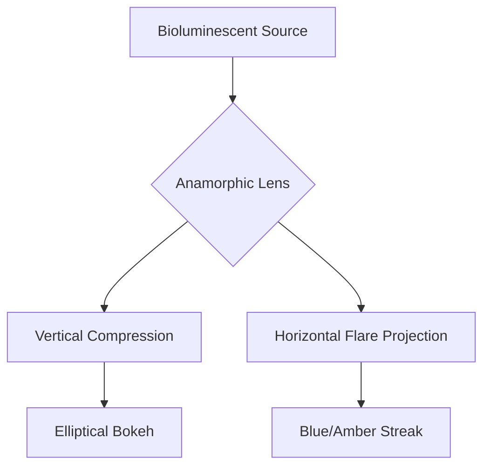

# Creatures in the Tall Grass - Production Bible

*Compiled on 4/10/2026, 1:43:23 PM*

---

<h2 id="entry-glow-logic">Glow Logic</h2>

*Category: Lore | File: lore/glow-logic.md*

---

# Glow Logic: Bioluminescent Physics

## 🔬 Overview
The creatures in the *Tall Grass* exhibit high-frequency bioluminescence generated via a specialized crystal-matrix organ located near the dorsal ridge. This light is not merely aesthetic; it is a primary communication and aggression vector.

## 🌈 Spectral Standards
The film utilizes specific wavelengths to denote creature intent and physiological state.

| State | Color | Wavelength ($\lambda$) | Frequency ($f$) |
| :--- | :--- | :--- | :--- |
| **Idle / Foraging** | Amber | $600nm$ | $\approx 500\,THz$ |
| **Aggression / Hunt** | Blue | $450nm$ | $\approx 666\,THz$ |
| **Distress** | Pulsing Violet | $400nm$ | $\approx 750\,THz$ |

### Mathematical Model of Pulse Frequency
The pulse rate ($P_r$) during aggression is modeled by:
$$P_r = \int_{t_0}^{t_1} A \cdot \sin(2\pi f_b t + \phi) dt$$
where $A$ is the arousal amplitude and $f_b$ is the base bioluminescent frequency.

---

## 🎞️ Anamorphic Behavior
To maintain the cinematic texture of the *Tall Grass*, the glow must interact specifically with the anamorphic optics.

### Optical Rules:
1. **Horizontal Stretching:** The glow must flare horizontally across the $2.39:1$ frame.
2. **Chromatic Aberration:** Edge illumination should show slight fringing matching the lens profile.
3. **Streak Decay:** Flares should follow a logarithmic decay curve: $I(x) = I_0 \cdot e^{-kx}$.

---

<h2 id="entry-creature-physiology">Creature Physiology</h2>

*Category: Lore | File: lore/creature-physiology.md*

---

# Creature Physiology

## Overview
The golden creatures (and their ecosystem) are defined by acoustic and electromagnetic behavior. This doc locks canonical details for VFX, sound design, and script continuity.

## Key Frequency: 115.3 MHz
- **Dial setting:** Mr. Mike’s numbers (1, 1, 5, 3) are **dial settings**, not map coordinates.
- Dallas’s to receive messages at and theoscillator at **115.3 MHz** stabilizes the injured creature and aligns with its “voice.”
- The creature’s back-holes emit a low, melodic tone at this band; equipment (oscilloscope, receiver) shows a clean sine in sync with its heartbeat.
- Any dialogue or action referring to “the numbers” or “coordinates” should be understood as this frequency/dial logic.

## Back-Holes and Vocalization
- Creatures **breathe and vocalize through openings on their backs** (back-holes), not a visible mouth.
- When calm: low, melodic tone. When distressed: the tone shifts to a sad cry or whimper; the hum from the marsh answers.
- Wires/clips on the creature’s head pick up signal; the same band that soothes can be used to communicate or to drive the reverse device.

## Crystals
- **Crystals** found in burn marks (e.g. at the hollow, in the grass) are **biological semiconductors** and **phase inverters**.
- Makayla’s crystal powers a small device; when placed near the creature, it amplifies connection (hair lifts, shared attention).
- Running the oscillator **through the crystal** doesn’t just broadcast—it can create a **shield / dome of silence** to protect the creature and repel the Red-Eyes’ canceling frequency.
- Asher’s pyramid-like crystal is the same family; he taps it twice when he’s sure (character beat).

## Reverse Device
- **Reverse audiophone:** plays a recording backward; repurposed with the crystal and oscillator to project an inverted field.
- **Phase-cancellation trap:** Two speakers, opposing frequencies, create an acoustic corridor (kill zone)—no physical wall. Set at the edge of the yard facing the marsh.
- The creature’s frequency, captured and replayed clean post-storm, is the proof Dallas keeps.

## Burn Marks
- Blackened, vein-like marks in grass (and on skin after contact) indicate **presence or passage** of the shadow creatures / Red-Eyes.
- Marks can spread (e.g. from driveway toward the house); the reverse device / 115.3 field can reverse the “infection” (veins lighten from dark brown to green).
- Yellow blood / residue at a burn center suggests the golden creatures’ physiology is opposed to the shadow state.

## Continuity Notes
- Sierra’s field notes (Branford 2004) and sketches pre-date the script events; her folder contains frequency notation that matches 115.3 and creature anatomy.
- Howie reacts to the creature and to the hum; use for tension (barking, shivering, ears toward the grass).

---

<h2 id="entry-red-eyes-and-shadows">Red-Eyes and Shadow Creatures</h2>

*Category: Lore | File: lore/red-eyes-and-shadows.md*

---

# Red-Eyes and Shadow Creatures

## Role in the Story
The **Red-Eyes** (and the larger **shadow creatures**) are the antagonists of the creature ecosystem. They hunt the golden, bioluminescent creatures and threaten anyone who protects them. If the Red-Eyes take the creatures, “it’s all ghost stories”—the evidence becomes myth.

## Behavior
- **Red-Eyes:** Pair (or more) of bright, dimming red eyes at the edge of the grass or yard; they watch the house and the creature. Associated with the burn marks and the creeping “vein” infection.
- **Shadow creatures:** Larger, predatory. They don’t hum; they **cancel** sound. “Sound disappears the way shadow erases light.” They move through the reeds at speed (“something massive rocketing toward him like an arrow”).
- They **snatch** the golden creatures one by one at the edge of the reeds; the elders among the golden ones can spray a mist and induce temporary paralysis in humans (to push Dallas and Makayla back), but they are no match for the shadows.

## Frequency Logic
- The golden creatures **hum** and communicate at 115.3 MHz; their glow and tone are one system.
- The Red-Eyes / shadows **erase the frequency**—they are acoustic predators. The reverse device (phase inversion, dome of silence) is the only way to hold them off and get the injured creature to safety.
- When the reverse device is on, shadow tentacles hit an “invisible barrier” with sparks of golden static; the trap at the yard is an acoustic kill zone, not a wall.

## Visual and Sound Design
- **Red eyes:** Bright, then dim, then bright; swirling through the grass; never full reveal. Suggest scale and intelligence without showing the full form.
- **Shadows:** Heavy, crushing movement; reeds parting; one by one the golden lights go out. Sound design: drop in low end, silence where the hum was, then the awful sound of “gnashing” when something takes the creature.
- **Stakes:** Makayla’s line—“If the Red-Eyes take them out tonight, this folder is just a collection of ghost stories”—drives the third act. The crew must return the creature and document before the shadows erase the evidence.

---

<h2 id="entry-anamorphic">Anamorphic</h2>

*Category: Optics | File: optics/anamorphic.md*

---

# The Anamorphic Lens Profile: "Tall Grass" Distortion

## 🎥 Camera Configuration: RED Komodo
The film is captured on the RED Komodo 6K global shutter sensor, utilizing a $2\times$ anamorphic squeeze factor to achieve the $2.39:1$ aspect ratio.

### Technical Infobox
| Parameter | Setting |
| :--- | :--- |
| **Sensor Mode** | 6K 17:9 (Anamorphic $2\times$) |
| **Resolution** | $6144 \times 3240$ (Pre-Desqueeze) |
| **Format** | R3D MQ / HQ |
| **Colorspace** | REDWideGamutRGB / Log3G10 |

---

## 🔍 Lens Profile: "The Vertical Stretch"
The visual identity of *Creatures in the Tall Grass* is defined by a heavy vertical distortion and extreme edge softness, simulating a vintage or "distressed" anamorphic look.

### Distortion Characteristics
1. **Vertical Stretching:** Objects at the frame edges exhibit a $1.2\times$ vertical elongation.
2. **Edge Softness:** Resolution drops significantly beyond the central $50\%$ of the frame.
3. **Flaring:** Asymmetric blue/amber flares corresponding to creature "Glow Logic."

### The "Tall Grass" Overlay Matrix
To simulate textured glass, the following overlay parameters are applied in post-processing:
- **Grain Density:** $0.04$
- **Micro-Scratches:** Vertical orientation, $80\%$ transparency.
- **Vignette:** Elliptical, $-1.5$ stops at edges.

---

## 📐 Optics Math
The desqueezed horizontal resolution ($R_h$) is calculated as:
$$R_h = W_{pixel} \times S_f$$
Where $W_{pixel}$ is the pixel width and $S_f$ is the squeeze factor ($2.0$).

Due to the $2.39:1$ crop from the desqueezed frame:
$$Aspect = \frac{R_h}{R_v \times \text{CropFactor}}$$

---

<h2 id="entry-dolly-tracks">Camera Setup: Dolly Tracks</h2>

*Category: Optics | File: optics/dolly-tracks.md*

---

# Camera Setup: DIY Dolly Tracks

To achieve smooth, tracking movements within the salt marsh and Dallas's house without a professional crew, we utilize a custom-built **Dolly Railroad** system.

## 🛠️ Build Specifications: The "Marsh Runner"
The dolly is designed for portability and stability on uneven terrain.

### Components
| Part | Material | Purpose |
| :--- | :--- | :--- |
| **Rails** | 2" Schedule 40 PVC Pipe | Lightweight, flexible, and rust-proof in saltwater environments. |
| **Sleeper Ties** | 2x4 Pressure-Treated Lumber | Provides rigid spacing for the rails (approx. 24" gauge). |
| **Dolly Platform** | 3/4" Plywood with Outdoor Carpet | Dampens vibration and provides a "grippy" surface for the tripod. |
| **Wheels** | 70mm Inline Skate Wheels | High-durometer wheels for minimal rolling resistance. |

---

## 🎥 Operation Logic
The RED Komodo is mounted on a standard tripod, which is then secured to the plywood platform via sandbags or bungee tie-downs.

### Tracking Techniques
1. **The "Marsh Slide":** Long, slow lateral tracks through the tall grass to simulate a predator's POV.
2. **The "Low-Angle Slink":** Tracks set directly on the mudflats for extreme low-angle shots of the creature.
3. **The "Storm Push":** Rapid tracking towards a subject during high-wind sequences to create a sense of urgency.

---

## 📐 DIY Schematic
> [!TIP]
> Use silicone-based lubricant on the PVC rails to ensure the inline wheels glide silently. Any squeaks will interfere with the bioacoustic recording (Dallas's job logic).

*(Reference Image: PVC pipe rails with wooden cross-braces and wheeled platform)*

---

<h2 id="entry-branford-and-marsh">Branford and the Marsh</h2>

*Category: Locations | File: locations/branford-and-marsh.md*

---

# Branford and the Marsh

## Setting
**Branford, CT** — coastal Connecticut, Long Island Sound. Southern New England. The story treats it as a real place with a town green, church fellowship, hardware store, and neighborhoods that back onto marsh and tall grass.

## The Tall Grass
- **Tall grass / reeds** are the threshold between the human world and the creature world. Golden-yellow reeds; boardwalks; creek bends; hollows where the injured creature is found.
- Characters repeatedly move from **lawn → edge of property → boardwalk → inside the grass**. The grass is both beautiful and dangerous; it sways, hides movement, and carries the hum.
- Key beat: “The place where the lawn becomes reed” (Creek Bend)—Dallas’s final recording location and the return point for the creature.

## Dallas’s House
- New house; Dallas has just moved in. Sparse, boxes, Sierra’s box (“Lepidoptera by Sierra”) in the living room. Backyard: old rusty lawn furniture, picnic table, fence of grass. The tall grass is right there.
- Basement: creature kept in a makeshift aquarium/shoebox; oscillator, receiver, cables. LifeGroup happens upstairs while the creature is downstairs.
- The burn marks appear on the edge of the yard and later creep toward the house (veins on siding, toward windows). The phase-cancellation trap is set at the edge of the yard facing the marsh.

## Dominic’s House
- Next door. Basement with Mr. Mike (70s), CRT equipment, numbers on the wall. Kitchen; Janice, Makayla, Asher. Howie the dog. The kids’ “lair” is in the woods (wigwam-style, surveillance gear, reverse audiophone).

## Town
- Town green; church fellowship lawn (CPC); picnic, spike ball, chicken primavera. Hardware store (Rudy’s; batteries). News vans; Pat Clendenen on camera. Coastal sidewalks; power lines; birds on the wire pointing southeast toward the marsh. Streetlights that flicker or go dark when the hum spikes.

## Marsh Trail and Creek Bend
- Wooden boardwalk through the reeds. Trailcam with solar pack. The hollow: gnarled tree, injured creature. Creek Bend: where Dallas finally stands with the receiver, recording, at the end. “The tall grass does not move—and neither does Dallas.”

## Production Notes
- Exteriors: grass, reeds, golden hour, salt breeze, storm light. Contrast “beautiful southern New England morning” (Pat on the radio) with the hum and the dread.
- Interiors: warm church fellowship vs. tense basement; domestic LifeGroup vs. creature downstairs. Keep the two worlds close so the spill (hum, lights dimming, Mr. Mike freaking) feels inevitable.

---

<h2 id="entry-location-list">Location List</h2>

*Category: Locations | File: locations/location-list.md*

---

# Location List (from script)

All INT/EXT locations as they appear in the script. Use for scheduling, tech scouts, and continuity.

---

## Dallas's house and property

| Slug | Notes |
|------|------|
| EXT. DALLAS NEW HOUSE - DAY | Move-in; boxes; backyard, grass at fence |
| INT. DALLAS NEW HOUSE - NIGHT | Sparse; Sierra's box |
| EXT. DALLAS HOUSE - NIGHT | Staring at grass |
| INT. DALLAS HOUSE - BEDROOM - NIGHT | Can't sleep; golden flicker |
| EXT. DALLAS HOUSE - NEXT DAY MORNING | Walk to town |
| EXT. DALLAS HOUSE - NEXT MORNING | Burn mark; Makayla at door |
| EXT. DALLAS's HOUSE - DOORWAY | "We should talk" |
| INT. DALLAS KITCHEN - DUSK / MOMENTS LATER / EVENING | Creature triage; oscilloscope; heat lamp |
| INT. DALLAS DESK - NIGHT | Recordings; Sierra's folders |
| INT. DALLAS' HOUSE - KITCHEN - EVENING | Creature in box; doorbell |
| INT. DALLAS' HOUSE - HALLWAY - NIGHT | Opens door to Dominic, kids |
| EXT. DALLAS BACKYARD - LATE AFTERNOON | Recording; creature cries |
| EXT. DALLAS BACKYARD - OLD PICNIC TABLE | Makayla, Dallas, Howie; conversation |
| INT. DALLAS'S KITCHEN - LATER / EVENING | Creature; oscilloscope; crystal |
| INT. DALLAS'S KITCHEN / LIVING ROOM - NIGHT | LifeGroup prep; families arrive |
| INT. DALLAS LIVING ROOM | LifeGroup circle |
| INT. DALLAS'S HALL - MOMENTS LATER | First family; Mr. Mike |
| INT. DALLAS MUDROOM - NIGHT (DURING LIFEGROUP) | Dallas, Makayla, Asher; oscillator rig |
| INT. DALLAS BASEMENT | Creature; equipment |
| INT. DALLAS'S BASEMENT - SAME TIME / CONTINUOUS / MORNING | Shoebox; creature; later burn-mark gear |
| INT. DALLAS'S LIVING ROOM - LATER | Hymn; tea ripples; Mr. Mike barges in |
| INT. BASEMENT (Dallas) | Creature escaped; search |
| EXT. DALLAS PORCH | Makayla, Asher, Dallas; "we should go to the fortress" |
| INT. DALLAS'S STUDY - SAME TIME | Sierra's folder; Makayla cross-references |
| EXT. DALLAS'S BACKYARD - CONTINUOUS / NIGHT | Folder; burn marks; red eyes at edge |
| INT. DALLAS'S LIVING ROOM - LATER | Decision to return creature |
| INT. DALLAS'S HOUSE - HALL / DEN - NIGHT | Dallas awake; video feed; creature gone |
| EXT. DALLAS'S BACKYARD - NIGHT (SAME) | Empty box; red eyes in grass |
| EXT. DALLAS BACKYARD | Burn marks; vein spread; oscillator test |
| EXT. DALLAS'S BACKYARD - CONTINUOUS | Phase-cancellation trap; storm |
| EXT. / INT. DALLAS'S HOUSE - LATER | After marsh; "this is crazy" |
| INT. DALLAS'S WORKSHOP / HOUSE - DAY | Aftermath; recording; plant |
| INT. DALLAS'S BEDROOM - NIGHT | Device on nightstand; echoes |
| EXT. DALLAS'S DRIVEWAY - MORNING | Janice; Howie handoff |

---

## Dominic's house

| Slug | Notes |
|------|------|
| INT. JACE'S BASEMENT | Kids' space; CRT; numbers on wall |
| INT. DOMINIC'S BASEMENT | Mr. Mike; photo; fan; table |
| INT. DOMINIC'S KITCHEN - LATE AFTERNOON | Janice; groceries; Howie; coordinates |
| EXT. DOMINIC'S HOUSE | Trash cans; burn marks |

---

## Town and church

| Slug | Notes |
|------|------|
| EXT. DALLAS HOUSE → TOWN | Walk with Dominic |
| EXT. TOWN BRANFORD MONTAGE | Sidewalks; marsh fences; birds on wire |
| EXT. TOWN CENTER - DAY | Hardware store area |
| INT. HARDWARE STORE | Batteries; Rudy |
| EXT. CHURCH FELLOWSHIP LAWN - LATE AFTERNOON | CPC; picnic; spike ball; Mary, Paul |
| EXT. BRANFORD TOWN COMMONS | Scene 20; Makayla, Dallas to grass |
| EXT. BRANFORD - DAY | Town normal; aftermath |
| EXT. BRANFORD - OUTSIDE PIZZA PLACE - DAY | Pat Clendenen interview |
| EXT. CHURCH GROUNDS - DAY | Aftermath; picnic; caterpillar |

---

## Marsh, grass, trail

| Slug | Notes |
|------|------|
| EXT. MARSH TRAIL - LATER / EVENING / CONTINUOUS | Boardwalk; Merlin app; reeds |
| EXT. BRANFORD ROCKS - EVENING | Waves; Howie; receiver |
| EXT. EDGE OF THE MARSH - CONTINUOUS | Hum; stillness |
| EXT. INSIDE THE TALL MARSH - SUNSET HOUR | Reeds; injured creature; gnarled tree |
| EXT. TALL GRASS - MOMENTS LATER | Chase; sprint out |
| EXT. COSTAL NEIGHBORHOOD JOURNEY | Dallas with creature; Howie |
| EXT. EDGE OF THE TALL GRASS | Crew; shoulder rig; enter |
| EXT. INSIDE THE TALLGRASS | Creature in gnarl; predators; device on |
| EXT. SALT MARSH - DAY (CONTINUOUS) | Elders; mist; red eyes; snatch |
| EXT. MARSH TRAIL - CONTINUOUS | Run back; creature placed down |
| EXT. EDGE OF TALL GRASS - DAY | Battle; Asher "Run" |
| EXT. CREEK BEND - DAY | Final; Dallas alone; receiver; recording |

---

## Makayla's lair

| Slug | Notes |
|------|------|
| EXT. MAKAYLA'S LAIR | Wigwam; woods; Long Island Sound |
| INT. MAKAYLA'S LAIR - CONTINUOUS | Creature; heat lamp; reverse device |
| INT. LAIR MONTAGE | Rig; crystal; oscillator; creature howl; Asher seizure |
| EXT. MAKAYLA'S LAIR | Escape; dark figures |
| EXT. MAKAYLA'S LAIR - LATE SUN | Storm; "17 years"; device ready |

---

## Visions / montage

| Slug | Notes |
|------|------|
| EXT. MAKAYLA'S VISION - MONTAGE | — |
| EXT. MARSH - DAY (VISION) | Mother figure; lullaby |
| INT. KITCHEN - DAY (Reality) | Makayla returns from vision |

---

## Summary counts

- **Dallas's house (INT/EXT):** primary location; kitchen, basement, living room, hallway, mudroom, bedroom, workshop, porch, backyard, driveway.
- **Dominic's:** basement (Jace's + Dominic's), kitchen; exterior trash.
- **Town:** hardware store, church fellowship lawn, town commons, church grounds, pizza place.
- **Marsh / grass:** trail, edge of marsh, inside tall marsh, inside tallgrass, salt marsh, creek bend, Branford rocks, coastal neighborhood.
- **Makayla's lair:** exterior and interior; woods by Sound.

Use this list with the script scene breakdown to map **which scenes use which locations** for day-out-of-days and location-based scheduling.

---

<h2 id="entry-style-guide">Tone and Style Guide</h2>

*Category: Tone | File: tone/style-guide.md*

---

# Tone and Style Guide

## Overall
*Creatures in the Tall Grass* is **pastoral dread**: southern New England small-town life (church, fellowship, neighbors, coffee) against an acoustic and ecological wrongness. The tone is grounded and specific—bioacoustics, oscillators, field notes—so the supernatural feels earned.

## Contrast Beats
- **Pat Clendenen:** “Beautiful southern New England morning” on the radio while the storm rolls in and the trap is set. One line of weather report can do a lot. The contrast is cruel and intentional.
- **LifeGroup:** Singing “Great Is Thy Faithfulness,” brownies, introductions—then the hum from the basement rises with the hymn. Sarah’s tea ripples in the cup. The domestic and the creature share the same air.
- **Sierra’s box:** Butterflies, field notes, the photo on the headphones. Grief is quiet; the creature’s frequency and her voice (on tape) are allowed to overlap without underlining.

## Visual Tone
- **Anamorphic:** Vertical stretch, edge softness, blue/amber flares. See Optics. The image should feel like a worn, textured lens on a real place.
- **Grass and reeds:** Golden, wind-driven, hiding movement. Dust motes and refracted light when Dallas is deep in the marsh. No need to make the grass “alien”—it’s the same grass that borders every backyard; the wrongness is in the sound and the eyes in the dark.
- **Creature:** Small, birdlike but not a bird; round, cotton-ball, dandelion-seed. Glow from the neck/back. Hurt but not grotesque. The audience should want to protect it.

## Sound Design
- **The hum:** Low, dense, multi-layered; “a living reed being forced through a massive throat.” It starts in Dallas’s teeth, then his chest. It’s the spine of the film. When it drops or stops, the silence is wrong.
- **Creature vocalization:** Melodic when calm; crying when scared. Equipment (receivers, scopes) reacts—golden static, needles spiking. The hum from outside answers the creature.
- **Red-Eyes / shadows:** Less hum, more canceling. Erasure of sound. Gnashing, movement through reeds. Keep the red eyes sparse—a pair at the edge of the frame, then gone.

## Performance and Dialogue
- Dallas: understated, tired, precise. He doesn’t explain; he tunes the dial.
- Makayla: driven, scientific, protective. “We can’t tell anyone.” “I’m not letting them become a myth again.”
- Asher: minimal dialogue; notebook, finger tracing patterns. His trance (“Bring me back”) and the tap-twice on the crystal are the main beats.
- Mr. Mike: prophecy and agitation; the numbers (115.3) are right. Don’t play him for comedy—play him as the one who’s been listening.

## Don’t
- Don’t over-explain the science. Let the equipment and the numbers do the work.
- Don’t show the full shadow creature. Erasure and suggestion are scarier.
- Don’t soften the pastoral. The church picnic and the fellowship are real; the dread works because the world is specific and lived-in.

---

<h2 id="entry-gear-gallery">DIY Gear Gallery</h2>

*Category: Production | File: production/gear-gallery.md*

---

# DIY Gear Gallery

Reference gallery for DIY gear, rigging, and techniques used on *Creatures in the Tall Grass*. Linked from the Summer hub and Production Center.

## Production standard

- **No fake engagement data.** The gallery does not display likes, comments, followers, or any Instagram-style metrics. It is a reference grid only.
- **No social branding.** No profile avatars, follow buttons, or handle-style headers. The page uses a simple title: "DIY Gear & Techniques."
- **No overlay stats.** Grid items do not show heart/comment counts on hover or elsewhere.

This keeps the gallery focused on build references and techniques for the production, not on social presentation.

---

<h2 id="entry-pr01">PE 1 — Arrival</h2>

*Category: Practical Effects | File: practical-effects/pr01.md*

---

# Practical effect 1 — Arrival

**Script:** Scene 1 · [s01.md](../../../script-system/scenes/s01.md) · Arrival & Discovery

## Locations

- EXT. DALLAS NEW HOUSE - DAY

## Practical effects

**I. Move-in boxes**
- Big pile of boxes; Dallas unloading. Backyard visible.
- *Approach:* Art dept: variety of moving boxes, some open.
- *Status:* —

**II. Backyard dressing**
- Old rusty lawn furniture, picnic table, fence of grass (edge of property).
- *Approach:* Source or dress: weathered furniture; grass/reed at fence line.
- *Status:* —

**III. Rig in reeds**
- Makeshift “trap” in grass—on closer look a **recording device** (stick + small rig).
- *Approach:* Build: simple stick rig with visible “recorder” element (wires, small box).
- *Status:* —

**IV. Bicycles**
- Makayla and Asher approach on bikes; Asher has spiral notebook in back pocket.
- *Approach:* Props: two bikes; notebook.
- *Status:* —

**V. Military oscillator**
- Dallas pulls out military-grade oscillator from boxes.
- *Approach:* Props: one hero oscillator (see lore/creature-physiology for 115.3 ref).
- *Status:* —

## Approach

- **Exterior only.** Prioritize backyard sightlines (grass at fence) and the rig-in-reeds reveal. Oscillator is a recurring hero prop—lock design early.
- Rig in reeds: readable as “trap” then “recording device” on approach; no need for working electronics.

## Notes

- First look at tall grass from Dallas’s POV. Establish scale of yard vs. grass edge.

---

<h2 id="entry-pr02">PE 2 — Dallas Night</h2>

*Category: Practical Effects | File: practical-effects/pr02.md*

---

# Practical effect 2 — Dallas Night

**Script:** Scene 2 · [s02.md](../../../script-system/scenes/s02.md) · Dallas Night

## Locations

- INT. DALLAS NEW HOUSE - NIGHT
- EXT. DALLAS HOUSE - NIGHT
- INT. DALLAS HOUSE - BEDROOM - NIGHT

## Practical effects

**I. Golden flicker (window)**
- Dallas sees “flicker of a faint gold light” in grass from living room window.
- *Approach:* Practical: small 600nm (amber) source in grass, diffused, or LED panel off-camera flicker. VFX assist to extend/sync.
- *Status:* —

**II. Sierra’s box**
- Box marked “Lepidoptera by Sierra”; sketches, vanilla folders, “FIELD NOTES — BRANFORD 2004,” desktop oscillator, portable recorder, portable oscillator, cables, retro red headphones.
- *Approach:* Art dept: hero box + contents (see creature-physiology for oscillator continuity).
- *Status:* —

**III. Photo sticker**
- Duct tape on headphone; peel back to reveal photo of Dallas and woman in field with headsets.
- *Approach:* Props: period photo print, tape; same headset type as hero.
- *Status:* —

**IV. Hum (off-screen)**
- Dallas hears HUM from outside; recorder needle spikes; he tunes to “pure, harmonic tone”; waveform spike around E; then battery dies.
- *Approach:* Sound design primary. Practical: receiver/recorder with moving needle (or screen playback). Hero C battery that “dies” (swap or cut power).
- *Status:* —

**V. Window / exterior**
- Dallas at window recording; later outside staring at grass; coyotes (sound).
- *Approach:* Night exterior: minimal fill; grass movement (wind or fan).
- *Status:* —

**VI. Golden glow (bedroom)**
- “Faint golden glow” again from window as he tries to sleep.
- *Approach:* Same amber source as earlier, or repeat flicker cue.
- *Status:* —

## Approach

- **Interior night:** One hero oscillator + recorder + Sierra box. Golden flicker is the only on-screen light effect; keep it subtle and repeatable for coverage.
- Battery die: scripted beat—ensure hero prop can cut or swap so “scrambling for C batteries” plays.

## Notes

- Establishes Sierra, the hum, and Dallas’s tuning. Oscillator and recorder recur in 11, 12, etc.

---

<h2 id="entry-pr03">PE 3 — The Hum</h2>

*Category: Practical Effects | File: practical-effects/pr03.md*

---

# Practical effect 3 — The Hum

**Script:** Scene 3 · [s03.md](../../../script-system/scenes/s03.md) · The Hum

## Locations

- EXT. DALLAS HOUSE - NEXT DAY MORNING
- EXT. TOWN BRANFORD MONTAGE
- EXT. TOWN CENTER - DAY
- INT. HARDWARE STORE

## Practical effects

**I. Sticky note “3, 5, 1”**
- Dallas writes numbers on sticky note (watch, clicking hand).
- *Approach:* Props: period sticky note; legible “3, 5, 1” (dial/coordinates ref).
- *Status:* —

**II. Birds on wire**
- Power line with ~30 birds in a row, beaks pointed southeast toward marsh.
- *Approach:* VFX or trained/bird rig; or single shot with VFX multiply. Production: coordinate with bird handler or plate.
- *Status:* —

**III. Streetlight flicker**
- Streetlight above them flickers once, twice, then steadies.
- *Approach:* Lighting: flicker cue on practical streetlight or gaffer flicker.
- *Status:* —

**IV. Small oscillator**
- Dallas takes out “small oscillator” and records by marsh.
- *Approach:* Same hero portable oscillator as pr02; continuity.
- *Status:* —

**V. Hardware store / batteries**
- Dominic and Dallas at battery section; Dallas finds correct batteries.
- *Approach:* Set dressing: hardware store battery display. C batteries for script continuity.
- *Status:* —

**VI. Dominic’s car / ticket**
- Orange ticket on windshield; Dominic hides ticket in glove box.
- *Approach:* Props: fake parking ticket; business with key.
- *Status:* —

## Approach

- **Town montage:** Focus on one or two strong “wrongness” beats—birds and streetlight are the main practical/VFX moments. Sticky note is a must for 115.3 payoff.
- Streetlight: simple flicker (dimmer or timed cut) is enough; no need for complex rig.

## Notes

- “3, 5, 1” and later “115.3” / “11.53” tie to Mr. Mike’s numbers (dial settings).

---

<h2 id="entry-pr04">PE 4 — Fellowship</h2>

*Category: Practical Effects | File: practical-effects/pr04.md*

---

# Practical effect 4 — Fellowship

**Script:** Scene 4 · [s04.md](../../../script-system/scenes/s04.md) · The Fellowship

## Locations

- EXT. CHURCH FELLOWSHIP LAWN - LATE AFTERNOON

## Practical effects

**I. Picnic / fellowship**
- Children running, light summer wear, spike ball, long food line, fold-up tables, chairs.
- *Approach:* Art dept + extras: church lawn picnic dressing; fold-up tables, water, food service.
- *Status:* —

**II. Dominic’s water**
- Dominic carries package of water, puts under table.
- *Approach:* Props: bottled water case.
- *Status:* —

**III. Mary / Paul**
- Mary (55), Paul (72); chicken primavera, handshakes, dialogue.
- *Approach:* Cast + props: plates, serving.
- *Status:* —

**IV. Janice, Makayla, Asher**
- Janice taps Dominic; Makayla and Asher in line; Asher doodling in spiral notebook.
- *Approach:* Costume + props: notebook (continuity with s01).
- *Status:* —

**V. Brush pile (distance)**
- Makayla and Asher leave line, huddle at “corner spot by end of church yard” over “pile of brush.” Dallas watches.
- *Approach:* Set dressing: brush pile or garden edge where kids can huddle; readable from food line.
- *Status:* —

## Approach

- **One location, one block.** All effects are art department and extras. No creature, no rigs—establish CPC and the kids’ secretive beat (brush pile).
- Spike ball, fold-up chairs, and food line sell “church fellowship”; keep period and tone consistent with Branford.

## Notes

- Howie handoff comes later (s07); no dog in this scene unless script revision adds.

---

<h2 id="entry-pr05">PE 5 — Marsh Trail</h2>

*Category: Practical Effects | File: practical-effects/pr05.md*

---

# Practical effect 5 — Marsh Trail

**Script:** Scene 5 · [s05.md](../../../script-system/scenes/s05.md) · Marsh Trail (The Merlin App)

## Locations

- EXT. MARSH TRAIL - LATER

## Practical effects

**I. Boardwalk**
- Wooden boardwalk through tall, golden-yellow reeds; sun dipping.
- *Approach:* Location or build: boardwalk section; reeds on both sides.
- *Status:* —

**II. Merlin app**
- Dominic pulls out phone, taps app—“listens to chirps, tells you species.”
- *Approach:* Props: smartphone with Merlin (or mock) app; playback of bird ID if needed.
- *Status:* —

**III. Garbage / cans**
- Dominic sees “garbage on the cans”; gets upset, breathing tough.
- *Approach:* Set dressing: trash near or on rail/cans; sell “someone’s been here.”
- *Status:* —

**IV. Inhaler**
- Dominic grabs asthma inhaler, deep breath.
- *Approach:* Props: standard inhaler.
- *Status:* —

**V. “Something moving underneath”**
- Script: something moving under boardwalk/reeds.
- *Approach:* Ambiguous: water ripple, reed movement, or shadow. Practical: reeds moving (cable-pull or wind); optional VFX subsurface movement.
- *Status:* —

## Approach

- **Exterior marsh, day.** Boardwalk + reeds are the main build/location. Merlin is a real app—use it or a locked screen that reads “Merlin” so it’s recognizable.
- “Something moving underneath” can be suggestive: reeds shifting, water bulge, or sound only. No creature reveal yet.

## Notes

- Establishes marsh tone and Dominic’s emotional beat. No creature, no equipment beyond phone.

---

<h2 id="entry-pr06">PE 6 — News Vans & Trash Cans</h2>

*Category: Practical Effects | File: practical-effects/pr06.md*

---

# Practical effect 6 — News Vans & Trash Cans

**Script:** Scene 6 · [s06.md](../../../script-system/scenes/s06.md) · News Vans & Trash Cans

## Locations

- EXT. BRANFORD NEIGHBORHOOD - CONTINUOUS
- EXT. DOMINIC'S HOUSE

## Practical effects

**I. (add)**
- e.g. news vans, Pat on camera, trash cans strewn, burn marks on driveway.
- *Approach:* build / buy / rig.
- *Status:* —

## Approach

- _How we'll tackle each effect._

## Notes

- _Burn marks: black sands, vein-like (see lore)._

---

<h2 id="entry-pr07">PE 7 — The Coordinates</h2>

*Category: Practical Effects | File: practical-effects/pr07.md*

---

# Practical effect 7 — The Coordinates

**Script:** Scene 7 · [s07.md](../../../script-system/scenes/s07.md) · The Coordinates

## Locations

- INT. JACE'S BASEMENT
- INT. DOMINIC'S BASEMENT (Makayla's Lair -1 )
- INT. DOMINIC'S Kitchen (or living room)

## Practical effects

**I. (add)**
- e.g. CRT equipment, numbers on wall, Mr. Mike scratching table, photo frame, receiver.
- *Approach:* build / buy / rig.
- *Status:* —

## Approach

- _How we'll tackle each effect._

1. For the Basement - We need a table in the side corner
2. We will use old TVs - found in church - they do not have to be on or functioning - we just have to add tape through the sides of them - maybe this could be a cool partical effect
3. We need to find a way for Mr. Mike to be scratching in 

## Notes

- _Coordinates = dial numbers (115.3)._
- Need to have the portable oscillator in this scene 

## PROPS
- Rocking Chair

---

<h2 id="entry-pr08">PE 8 — Dallas Marsh Walk</h2>

*Category: Practical Effects | File: practical-effects/pr08.md*

---

# Practical effect 8 — Dallas Marsh Walk

**Script:** Scene 8 · [s08.md](../../../script-system/scenes/s08.md) · Dallas Marsh Walk

## Locations

- EXT. BRANFORD ROCKS - EVENING
- EXT. EDGE OF THE MARSH - CONTINUOUS
- EXT. MARSH TRAIL - EVENING

## Practical effects

**I. (add)**
- e.g. trailcam, solar pack, handheld scope, waveform, golden flicker in hollow.
- *Approach:* build / buy / rig.
- *Status:* —

## Approach

- _How we'll tackle each effect._

## Notes

- _Storm warning on phone; streetlights go dark then return._

---

<h2 id="entry-pr09">PE 9 — Dallas Night Work</h2>

*Category: Practical Effects | File: practical-effects/pr09.md*

---

# Practical effect 9 — Dallas Night Work (The Injured One)

**Script:** Scene 9 · [s09.md](../../../script-system/scenes/s09.md) · Dallas Night Work

## Locations

- EXT. INSIDE THE TALL MARSH - SUNSET HOUR

## Practical effects

**I. (add)**
- e.g. reeds, dust motes, gnarled tree, **injured creature** (puppet/animatronic/VFX), glow.
- *Approach:* build / buy / rig / VFX.
- *Status:* —

## Approach

- _How we'll tackle each effect. Creature is central._

## Notes

- _Shadows in distance; Dallas grabs creature, walks out._

---

<h2 id="entry-pr10">PE 10 — The Chase</h2>

*Category: Practical Effects | File: practical-effects/pr10.md*

---

# Practical effect 10 — The Chase (Creature Discovery)

**Script:** Scene 10 · [s10.md](../../../script-system/scenes/s10.md) · Shadows in Wind

## Locations

- EXT. TALL GRASS - MOMENTS LATER

## Practical effects

**I. (add)**
- e.g. chase through reeds, creature in coat, creature's neck glow fading amber, Howie at cedar.
- *Approach:* build / buy / rig / VFX.
- *Status:* —

## Approach

- _How we'll tackle each effect._

## Notes

- _Heavy sound design; something massive in reeds._

---

<h2 id="entry-pr11">PE 11 — Howie Walk</h2>

*Category: Practical Effects | File: practical-effects/pr11.md*

---

# Practical effect 11 — Howie Walk (Kitchen Triage)

**Script:** Scene 11 · [s11.md](../../../script-system/scenes/s11.md) · Howie Walk (Edge of Marsh)

## Locations

- EXT. COSTAL NEIGHBORHOOD JOURNEY
- INT. DALLAS KITCHEN - DUSK / MOMENTS LATER
- EXT. DALLAS BACKYARD - LATE AFTERNOON
- INT. DALLAS DESK - NIGHT
- INT. DALLAS' HOUSE - HALLWAY - NIGHT

## Practical effects

**I. (add)**
- e.g. creature in aluminum pan, parchment, macro lens, creature cry → equipment golden static, heat lamp, shoebox.
- *Approach:* build / buy / rig / VFX.
- *Status:* —

## Approach

- _How we'll tackle each effect._

## Notes

- _Sierra's voice on tape; overhead light dim then return._

---

<h2 id="entry-pr12">PE 12 — The Burn Mark & Costco</h2>

*Category: Practical Effects | File: practical-effects/pr12.md*

---

# Practical effect 12 — The Burn Mark & Costco

**Script:** Scene 12 · [s12.md](../../../script-system/scenes/s12.md) · The Burn Mark & Costco

## Locations

- INT. DALLAS DESK

## Practical effects

**I. (add)**
- e.g. wires on creature's head, handheld, creature tone through back-holes, Howie in corner.
- *Approach:* build / buy / rig / VFX.
- *Status:* —

## Approach

- _How we'll tackle each effect._

## Notes

- _Creature whimper; holes shift._

---

<h2 id="entry-pr13">PE 13 — Entering Grass & The Hollow</h2>

*Category: Practical Effects | File: practical-effects/pr13.md*

---

# Practical effect 13 — Entering Grass & The Hollow

**Script:** Scene 13 · [s13.md](../../../script-system/scenes/s13.md) · Entering Grass & The Hollow

## Locations

- EXT. DALLAS HOUSE - NEXT MORNING
- EXT. DALLAS's HOUSE - DOORWAY
- INT. DALLAS KITCHEN - MOMENTS LATER

## Practical effects

**I. (add)**
- e.g. **burn mark in grass**, crystal, Makayla's hair static, creature in aquarium, oscilloscope spark.
- *Approach:* build / buy / rig / VFX.
- *Status:* —

## Approach

- _How we'll tackle each effect._

## Notes

- _Burn mark: jagged, blackened; yellow blood trail (see lore)._

---

<h2 id="entry-pr14">PE 14 — Creature Rescue</h2>

*Category: Practical Effects | File: practical-effects/pr14.md*

---

# Practical effect 14 — Creature Rescue (The Vision)

**Script:** Scene 14 · [s14.md](../../../script-system/scenes/s14.md) · Creature Rescue

## Locations

- INT. DALLAS KITCHEN
- EXT. DALLAS BACKYARD - OLD PICNIC TABLE
- INT. DALLAS'S KITCHEN - LATER
- EXT. MAKAYLA'S VISION - MONTAGE / EXT. MARSH (VISION)
- INT. KITCHEN - DAY (Reality)

## Practical effects

**I. (add)**
- e.g. oscilloscope to creature, crystal in device, creature howl → equipment spike, Makayla vision (mother silhouette), doorbell.
- *Approach:* build / buy / rig / VFX.
- *Status:* —

## Approach

- _How we'll tackle each effect._

## Notes

- _115.3 MHz; secondary jagged signal "draw"; Sarah's tea ripples later._

---

<h2 id="entry-pr15">PE 15 — The Burn Mark (Lair)</h2>

*Category: Practical Effects | File: practical-effects/pr15.md*

---

# Practical effect 15 — The Burn Mark (Makayla's Lair)

**Script:** Scene 15 · [s15.md](../../../script-system/scenes/s15.md) · The Burn Mark

## Locations

- EXT. MAKAYLA'S LAIR
- INT. MAKAYLA'S LAIR - CONTINUOUS
- INT. LAIR MONTAGE

## Practical effects

**I. (add)**
- e.g. wigwam, surveillance gear, reverse audiophone, crystal, oscillator + crystal, creature wake/howl, equipment freak-out, Asher seizure "Bring me back".
- *Approach:* build / buy / rig / VFX.
- *Status:* —

## Approach

- _How we'll tackle each effect._

## Notes

- _Phase inverter; dome of silence concept._

---

<h2 id="entry-pr16">PE 16 — The Escape</h2>

*Category: Practical Effects | File: practical-effects/pr16.md*

---

# Practical effect 16 — Back Home

**Script:** Scene 16 · [s16.md](../../../script-system/scenes/s16.md) · Back Home

## Locations

- EXT. MAKAYLA'S LAIR
- EXT. DALLAS HOUSE

## Practical effects

**I. (add)**
- e.g. dark figures in distance, Howie, Janice/van.
- *Approach:* build / buy / rig / VFX.
- *Status:* —

## Approach

- _How we'll tackle each effect._

## Notes

- _Asher: "The light doesn't leave."_

---

<h2 id="entry-pr17">PE 17 — Makeshift Hospital</h2>

*Category: Practical Effects | File: practical-effects/pr17.md*

---

# Practical effect 18 — Entering Grass (Makayla's Bond)

**Script:** Scene 18 · [s17.md](../../../script-system/scenes/s17.md) · Entering Grass

## Locations

- INT. DALLAS BASEMENT

## Practical effects

**I. (add)**
- e.g. creature fading, dial change → creature perks up.
- *Approach:* build / buy / rig / VFX.
- *Status:* —

## Approach

- _How we'll tackle each effect._

## Notes

- _"Red eyes take it. And take us."_

---

<h2 id="entry-pr18">PE 18 — Entering Grass</h2>

*Category: Practical Effects | File: practical-effects/pr17.md*

---

# Practical effect 18 — Entering Grass (Makayla's Bond)

**Script:** Scene 18 · [s17.md](../../../script-system/scenes/s17.md) · Entering Grass

## Locations

- INT. DALLAS BASEMENT

## Practical effects

**I. (add)**
- e.g. creature fading, dial change → creature perks up.
- *Approach:* build / buy / rig / VFX.
- *Status:* —

## Approach

- _How we'll tackle each effect._

## Notes

- _"Red eyes take it. And take us."_

---

<h2 id="entry-pr19">PE 19 — Life Group Arrives</h2>

*Category: Practical Effects | File: practical-effects/pr18.md*

---

# Practical effect 19 — Life Group Arrives

**Script:** Scene 19 · [s18.md](../../../script-system/scenes/s18.md) · Life Group Arrives

## Locations

- INT. DALLAS'S KITCHEN / LIVING ROOM - NIGHT
- INT. DALLAS'S KITCHEN - EVENING
- INT. DALLAS LIVING ROOM
- INT. DALLAS'S HALL - MOMENTS LATER
- INT. BASEMENT - CONTINUOUS
- INT. DALLAS' BASEMENT - CONTINUOUS

## Practical effects

**I. (add)**
- e.g. families, brownies, creature downstairs glowing, hum perks up, Mr. Mike freaks, Makayla drops plate.
- *Approach:* build / buy / rig / VFX.
- *Status:* —

## Approach

- _How we'll tackle each effect._

## Notes

- _Lights stabilize when Dallas adjusts dial._

---

<h2 id="entry-pr20">PE 20 — Basement Huddle</h2>

*Category: Practical Effects | File: practical-effects/pr20.md*

---

# Practical effect 22 — Red Eyes (Sierra's Folder)

**Script:** Scene 22 · [s20.md](../../../script-system/scenes/s20.md) · Red Eyes

## Locations

- EXT. DALLAS PORCH
- INT. DALLAS'S STUDY - SAME TIME
- EXT. DALLAS'S BACKYARD - CONTINUOUS
- INT. DALLAS'S LIVING ROOM - LATER

## Practical effects

**I. (add)**
- e.g. Sierra's folder, sketches, frequency notation, hum, decision to return creature.
- *Approach:* build / buy / rig.
- *Status:* —

## Approach

- _How we'll tackle each effect._

## Notes

- _"If the Red-Eyes take them out tonight, this folder is just ghost stories."_

---

<h2 id="entry-pr21">PE 21 — The Hymn</h2>

*Category: Practical Effects | File: practical-effects/pr19.md*

---

# Practical effect 21 — The Hymn

**Script:** Scene 21 · [s19.md](../../../script-system/scenes/s19.md) · The Hymn

## Locations

- INT. DALLAS'S BASEMENT - SAME TIME
- INT. DALLAS'S LIVING ROOM - LATER
- INT. BASEMENT

## Practical effects

**I. (add)**
- e.g. creature in shoebox, crystal glow, Makayla hair lifts, hymn rises with hum, **lights dim in time with creature**, Sarah's tea ripples, Mr. Mike barges in, creature escaped.
- *Approach:* build / buy / rig / VFX.
- *Status:* —

## Approach

- _How we'll tackle each effect._

## Notes

- _Key sequence: domestic + creature spill._

---

<h2 id="entry-pr22">PE 22 — Red Eyes</h2>

*Category: Practical Effects | File: practical-effects/pr20.md*

---

# Practical effect 22 — Red Eyes (Sierra's Folder)

**Script:** Scene 22 · [s20.md](../../../script-system/scenes/s20.md) · Red Eyes

## Locations

- EXT. DALLAS PORCH
- INT. DALLAS'S STUDY - SAME TIME
- EXT. DALLAS'S BACKYARD - CONTINUOUS
- INT. DALLAS'S LIVING ROOM - LATER

## Practical effects

**I. (add)**
- e.g. Sierra's folder, sketches, frequency notation, hum, decision to return creature.
- *Approach:* build / buy / rig.
- *Status:* —

## Approach

- _How we'll tackle each effect._

## Notes

- _"If the Red-Eyes take them out tonight, this folder is just ghost stories."_

---

<h2 id="entry-pr23">PE 23 — Creature Missing</h2>

*Category: Practical Effects | File: practical-effects/pr21.md*

---

# Practical effect 23 — Creature Missing (Night Fears)

**Script:** Scene 23 · [s21.md](../../../script-system/scenes/s21.md) · Creature Missing

## Locations

- INT. DALLAS'S HOUSE - HALL / DEN - NIGHT
- EXT. DALLAS'S BACKYARD - NIGHT (SAME)

## Practical effects

**I. (add)**
- e.g. candle shadows, video feed of empty box, **red eyes** at edge of yard (pair, bright/dim), red eyes in grass, burn mark on Dallas's arm glowing.
- *Approach:* build / buy / rig / VFX.
- *Status:* —

## Approach

- _How we'll tackle each effect._

## Notes

- _Red eyes: sparse, suggestive (see lore)._

---

<h2 id="entry-pr24">PE 24 — Marsh Confrontation</h2>

*Category: Practical Effects | File: practical-effects/pr22.md*

---

# Practical effect 24 — Marsh Confrontation (The Burn Marks)

**Script:** Scene 24 · [s22.md](../../../script-system/scenes/s22.md) · Marsh Confrontation

## Locations

- INT. DALLAS'S BASEMENT - MORNING
- EXT. DALLAS BACKYARD
- EXT. MAKAYLA'S LAIR - LATE SUN

## Practical effects

**I. (add)**
- e.g. **burn marks on ground + vein spread toward house**, burn marks on Dallas + Makayla arms, portable speaker on picnic table, **reverse device test** → grass freezes, veins lighten dark→green, storm clouds.
- *Approach:* build / buy / rig / VFX.
- *Status:* —

## Approach

- _How we'll tackle each effect._

## Notes

- _Phase-cancellation / reverse device (see creature-physiology)._

---

<h2 id="entry-pr25">PE 25 — Predator Attack</h2>

*Category: Practical Effects | File: practical-effects/pr23.md*

---

# Practical effect 25 — Predator Attack (Into the Marsh)

**Script:** Scene 25 · [s23.md](../../../script-system/scenes/s23.md) · Predator Attack

## Locations

- EXT. EDGE OF THE TALL GRASS
- EXT. INSIDE THE TALLGRASS

## Practical effects

**I. (add)**
- e.g. shoulder rig device, creature in gnarl + second crystal, **dark creatures swarm**, device on 1153 → barrier sparks (golden static), Dallas + Makayla arm pain.
- *Approach:* build / buy / rig / VFX.
- *Status:* —

## Approach

- _How we'll tackle each effect._

## Notes

- _Shadow tentacles hit invisible barrier._

---

<h2 id="entry-pr26">PE 26 — The Perimeter</h2>

*Category: Practical Effects | File: practical-effects/pr24.md*

---

# Practical effect 26 — The Perimeter

**Script:** Scene 26 · [s24.md](../../../script-system/scenes/s24.md) · The Perimeter

## Locations

- EXT. SALT MARSH - DAY (CONTINUOUS)
- EXT. MARSH TRAIL - CONTINUOUS

## Practical effects

**I. (add)**
- e.g. elder mist, paralysis (Dallas/Makayla walk backward), golden lights + **red eyes multiply**, red eyes snatch lights, creature pulse blinks out, Dallas dial → creature flares, Dallas grabs creature and runs, creature motionless, Makayla's crystal → amber sphere.
- *Approach:* build / buy / rig / VFX.
- *Status:* —

## Approach

- _How we'll tackle each effect._

## Notes

- _Sound erasure; "They're erasing the frequency."_

---

<h2 id="entry-pr27">PE 27 — The Last Dinner</h2>

*Category: Practical Effects | File: practical-effects/pr25.md*

---

# Practical effect 27 — The Last Dinner (The Trap)

**Script:** Scene 27 · [s25.md](../../../script-system/scenes/s25.md) · The Last Dinner

## Locations

- EXT. EDGE OF TALL GRASS - DAY
- EXT. / INT. DALLAS'S HOUSE - LATER
- EXT. DALLAS'S BACKYARD - CONTINUOUS

## Practical effects

**I. (add)**
- e.g. battle in marsh (pulse vs shadow), Asher panic "Run", **phase-cancellation trap**: oscillator, receiver, two speakers, corridor, sensor, Pat on radio "beautiful southern New England morning", storm rolls in.
- *Approach:* build / buy / rig / VFX.
- *Status:* —

## Approach

- _How we'll tackle each effect._

## Notes

- _Trap is acoustic kill zone, not a wall._

---

<h2 id="entry-pr28">PE 28 — Final Echoes</h2>

*Category: Practical Effects | File: practical-effects/pr26.md*

---

# Practical effect 28 — Final Echoes (The Morning After)

**Script:** Scene 28 · [s26.md](../../../script-system/scenes/s26.md) · Final Echoes

## Locations

- (Dallas's house / aftermath)

## Practical effects

**I. (add)**
- e.g. crew sleeping, Mr. Mike watching movie, Janice arrival.
- *Approach:* build / buy / rig.
- *Status:* —

## Approach

- _How we'll tackle each effect._

## Notes

- _Climax aftermath; light vs shadow done._

---

<h2 id="entry-pr29">PE 29 — Aftermath</h2>

*Category: Practical Effects | File: practical-effects/pr27.md*

---

# Practical effect 29 — Aftermath

**Script:** Scene 29 · [s27.md](../../../script-system/scenes/s27.md) · Aftermath

## Locations

- EXT. BRANFORD - DAY
- EXT. DALLAS HOUSE
- EXT. BRANFORD - OUTSIDE PIZZA PLACE - DAY
- EXT. CHURCH GROUNDS - DAY
- INT. DALLAS'S WORKSHOP / HOUSE - DAY
- INT. DALLAS'S BEDROOM - NIGHT
- EXT. DALLAS'S DRIVEWAY - MORNING
- EXT. CREEK BEND - DAY

## Practical effects

**I. (add)**
- e.g. scattered equipment, sensor blinking, **one clean recording** (creature tune), Sierra's photo, Pat interview, church picnic, Makayla + caterpillar jar, Asher notebook, Sierra's folder "Circadian Cycles", Dallas recording at creek bend.
- *Approach:* build / buy / rig.
- *Status:* —

## Approach

- _How we'll tackle each effect._

## Notes

- _Final beat: Dallas at creek bend, receiver, tall grass still._

---

<h2 id="entry-scene-list">Scene List</h2>

*Category: Production | File: production/scene-list.md*

---

# Summer Script - Scene List

This list contains all the scene and sub-scene identifiers found in the `pages/summer/script-system/scenes/` directory.

## Scenes

- **s01**: s01.1
- **s02**: s02.1, s02.2, s02.3, s02.4, s02.5, s02.6, s02.7
- **s03**: s03.1, s03.2, s03.3, s03.4, s03.5, s03.6, s03.7
- **s04**: s04.1
- **s05**: s05.1
- **s06**: s06.1, s06.2
- **s07**: s07.1, s07.2, s07.3
- **s08**: s08.1, s08.2, s08.3, s08.4
- **s09**: s09.1
- **s10**: s10.1, s10.2, s10.3
- **s11**: s11.1, s11.2, s11.3, s11.4, s11.5, s11.6, s11.7, s11.8
- **s12**: s12.1
- **s13**: s13.1, s13.2, s13.3
- **s14**: s14.1, s14.2, s14.3, s14.4
- **s15**: s15.1, s15.2
- **s16**: s16.1, s16.2, s16.3, s16.4
- **s17**: s17.1
- **s18**: s18.1, s18.2, s18.3, s18.4, s18.5, s18.6
- **s19**: s19.1, s19.2, s19.3, s19.4
- **s20**: s20.1, s20.2, s20.3, s20.4
- **s21**: s21.1, s21.2
- **s22**: s22.1, s22.2, s22.3
- **s23**: s23.1, s23.2, s23.3
- **s24**: s24.1
- **s25**: s25.1
- **s26**: s26.1, s26.2
- **s27**: s27.1, s27.2, s27.3, s27.4, s27.5
- **s28**: s28.1, s28.2, s28.3, s28.4

---

