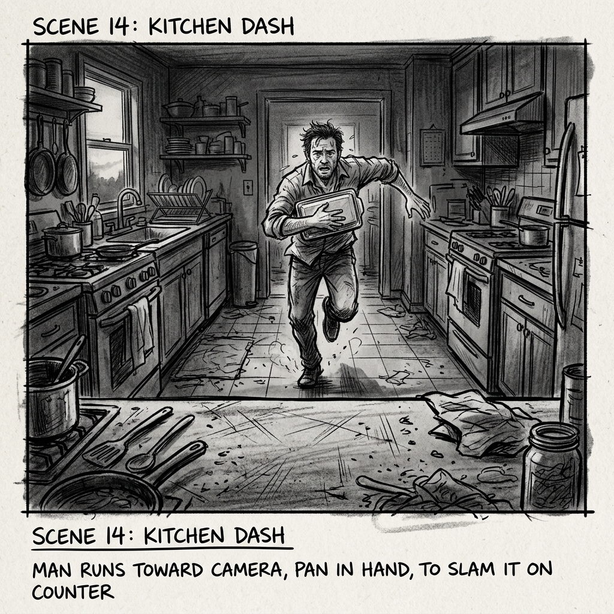
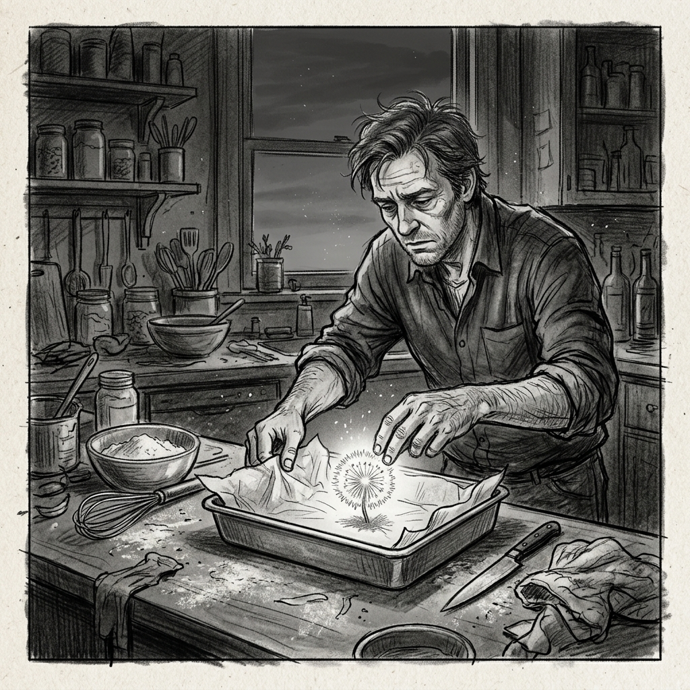
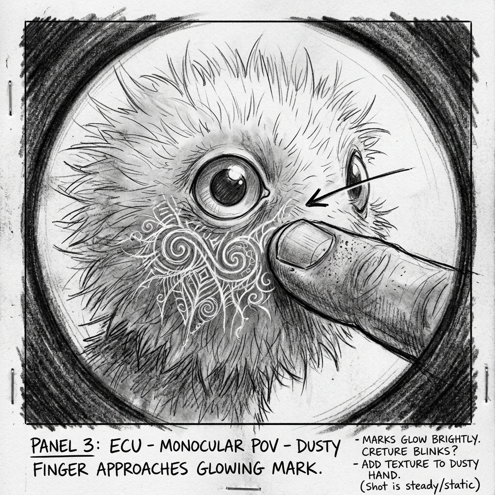
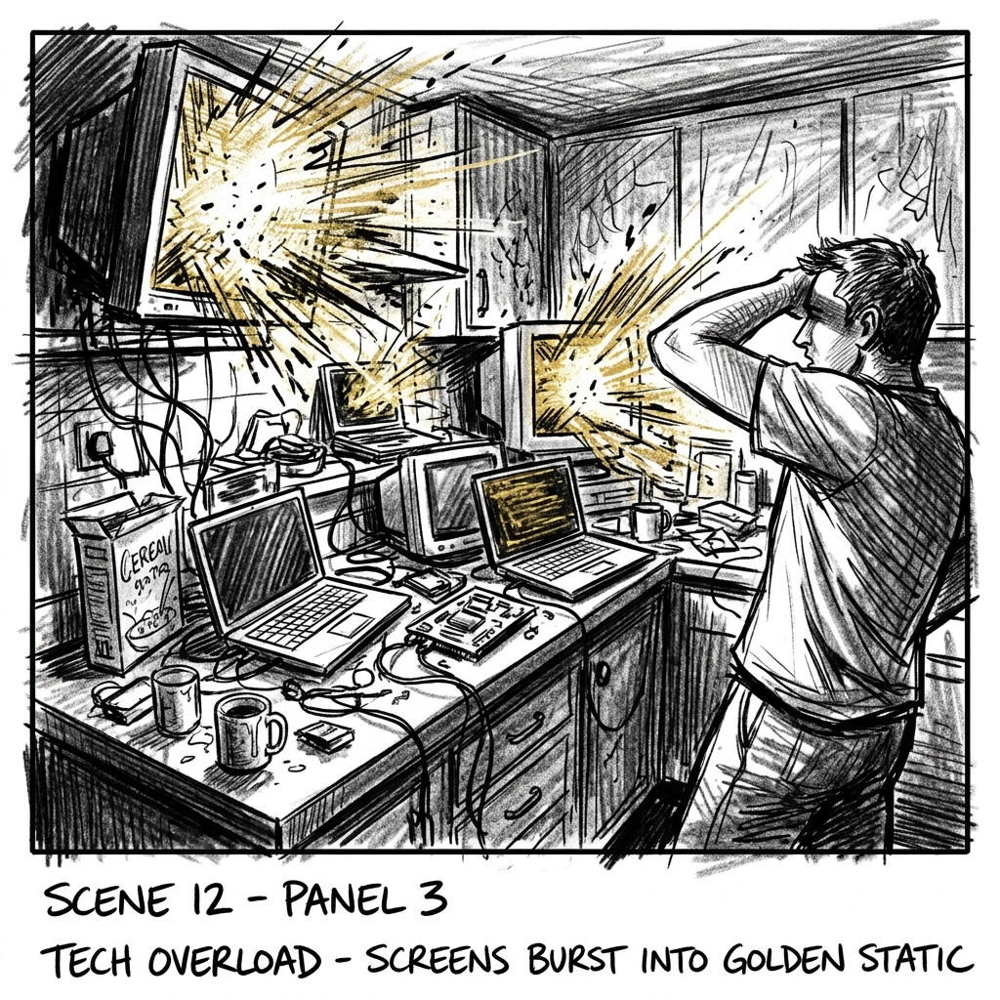
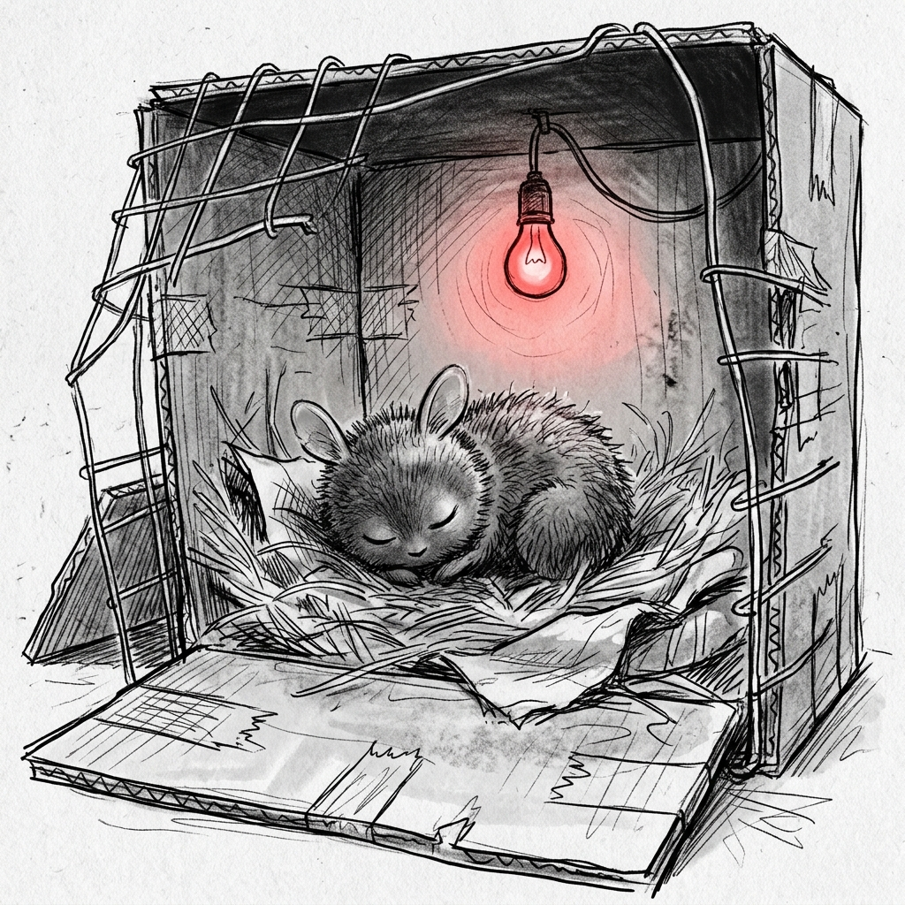

## Scene 11: Kitchen Triage
- Setting: INT. DALLAS KITCHEN / WORKSHOP / DESK / HALLWAY - DUSK INTO NIGHT
- Beat: Dallas brings the creature inside, triggering anomalous technical phenomena, builds it a makeshift habitat, and fields a check-in from his neighbor Dominic while battling exhaustion.

### Shot 11.01 - WIDE
- Size: Wide
- Camera: **Position:** Center - inside the kitchen facing the hallway entrance. Low angle, handheld, tracking backward slightly.
- Action: Dallas rushes into the kitchen carrying the aluminum pan, running directly toward the lens to slam the pan down onto the counter in the extreme foreground.
- Caption: Dallas rushes inside to set up a triage station.

### Shot 11.02 - MEDIUM
- Size: Medium
- Camera: **Position:** Slightly high angle looking down at the kitchen counter. Static.
- Action: Dallas quickly lines the pan with parchment paper and gently places the creature inside. Howie barks off-screen.
- Caption: Dallas sets the creature in the aluminum pan.

### Shot 11.03 - CLOSEUP
- Size: Closeup
- Camera: Static
- Action: Macro monoculars lift into frame. Dallas peers intently through them.
- Caption: Dallas observes the creature through macro monoculars.

### Shot 11.04 - EXTREME CLOSEUP
- Size: Extreme Closeup
- Camera: Static POV
- Action: Through the monoculars, detailed marks underneath the creature's eye are visible. Dallas's finger enters the frame and touches a mark.
- Caption: Dallas touches the strange marks under the creature's eye.

### Shot 11.05 - MEDIUM
- Size: Medium
- Camera: Handheld, slightly jerky
- Action: The creature suddenly wakes and lets out a cry. Dallas pulls back slightly.
- Caption: The creature wakes and cries out.

### Shot 11.06 - WIDE
- Size: Wide
- Camera: Static
- Action: The kitchen monitors and equipment violently flare with golden static. The room is bathed in golden light.
- Caption: Dallas's equipment bursts with golden static.

### Shot 11.07 - MEDIUM
- Size: Medium
- Camera: Tracking
- Action: Dallas moves to his workshop, rapidly gathering spare objects, wires, and a makeshift box to build a habitat.
- Caption: Dallas constructs a makeshift habitat from spare parts.

### Shot 11.08 - CLOSEUP
- Size: Closeup
- Camera: Static
- Action: Dallas flicks a switch. The lighting inside the makeshift box changes to a soft red hue.
- Caption: Dallas turns on a red light for the creature.

### Shot 11.09 - MEDIUM WIDE
- Size: Medium Wide
- Camera: Static
- Action: Nighttime. Dallas sits at his desk surrounded by haphazard wires, scanning frequencies on his computer.
- Caption: Dallas scans frequencies at his desk late at night.

### Shot 11.10 - CLOSEUP
- Size: Closeup
- Camera: Static
- Action: The computer monitor shows a spike at the 115.2GHZ frequency. Dallas listens closely.
- Caption: The equipment registers a pulse at 115.2GHZ.

### Shot 11.11 - MEDIUM
- Size: Medium
- Camera: Static
- Action: Dallas plays Sierra's piano tape on a small recorder. He watches the creature calm down.
- Caption: Dallas plays a soothing cassette tape for the creature.

### Shot 11.12 - CLOSEUP
- Size: Closeup
- Camera: Static
- Action: The tape recorder clicks to a stop. Dallas presses play again, but looks distraught—it's blank.
- Caption: The tape goes blank.

### Shot 11.13 - MEDIUM OTS
- Size: Medium Over-The-Shoulder
- Camera: Static OTS
- Action: Dallas bumps a stack of folders. A corner of a sketch with golden tones slides out. He pushes it closed.
- Caption: Dallas catches an accidental glimpse of a golden sketch.

### Shot 11.14 - WIDE 
- Size: Wide
- Camera: Locked-off
- Action: Dallas stands at his open front door, handing Howie over to Dominic in the hallway.
- Caption: Dallas hands Howie back to Dominic.

### Shot 11.15 - MEDIUM
- Size: Medium
- Camera: Handheld OTS
- Action: Dominic looks past Dallas at the chaotic equipment in the background. Dominic looks concerned.
- Caption: Dominic notices the strange equipment.

### Shot 11.16 - POV WIDE
- Size: POV WIDE
- Camera: Static POV
- Action: Dallas's POV watching Dominic walk away, the tall marsh grass swaying in the wind beyond.
- Caption: Dallas watches Dominic leave as the marsh grass sways.

### Shot 11.17 - CLOSEUP
- Size: Closeup
- Camera: Static
- Action: The creature sleeping peacefully under the soft red light.
- Caption: The creature sleeps peacefully in its new habitat.

***

## 3D Asset List (For Storyboarder)

### Characters
- **Dallas**: Human male, disheveled, extremely exhausted.
- **The Creature**: Small owl/cottonball-like animal, glowing, fuzzy, with marks under its eyes.
- **Dominic**: Human male, neighbor, casual evening clothes.
- **Howie**: Small dog.

### Environment & Sets
- **Dallas's Kitchen**: Messy, with various tech equipment spilling onto the counters.
- **Dallas's Workshop/Desk**: Cluttered with spare parts, wires, monitors, and the makeshift computer setup.
- **Dallas's Hallway/Front Door**: View looking out into the night and the swaying marsh grass.

### Props & Equipment
- **Aluminum Pan & Parchment Paper**
- **Macro Monoculars**: Thick, heavy-duty optical device.
- **Computer & Monitors**: Displays capable of showing complex frequency graphs and golden static.
- **Makeshift Habitat**: A box constructed of spare parts, wires, blanket, and a red light bulb.
- **Tape Recorder & Cassette**: Sierra's small audio player.
- **Folders and Sketch**: A stack of files containing a sketch with golden elements.
